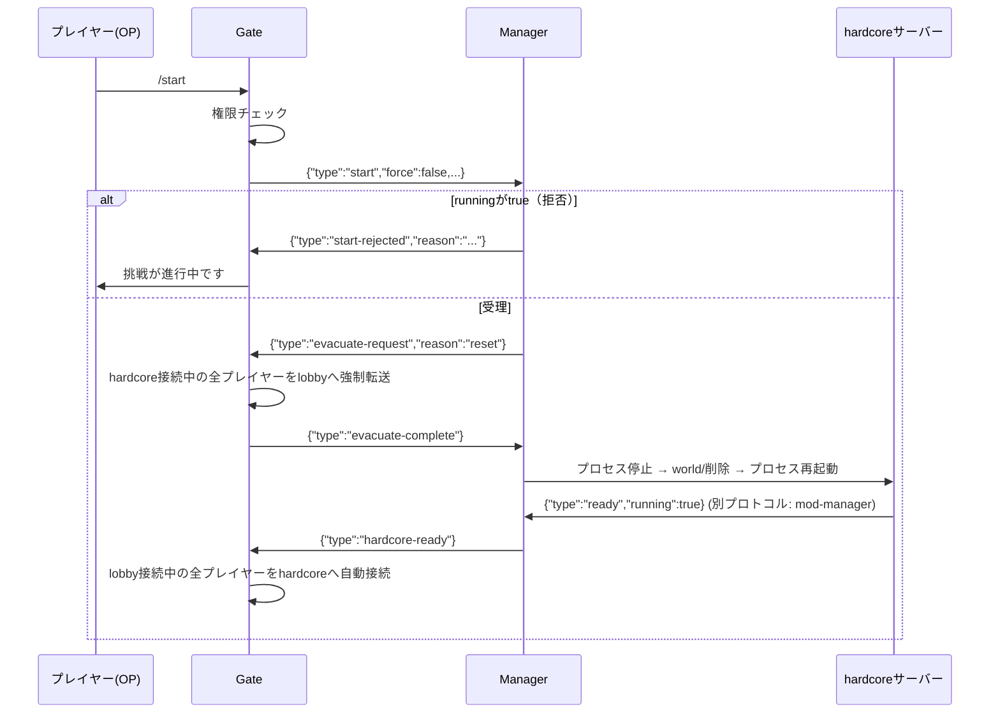

# Gate ⇔ Manager シグナルプロトコル

`specification.md` 7節の詳細版。Gate（プロキシ、Go）とManager（プロセス管理・アーカイブ・記録参照、Go）の間で、コマンド仲介と状態同期を行うためのプロトコル。

## 1. 前提・トランスポート

| 項目 | 内容 |
|---|---|
| トランスポート | TCPソケット |
| 待受アドレス | Manager側が設定可能（例：`0.0.0.0:<gateApiPort>`）。Docker network内のみで到達可能とし、ホストへは公開しない |
| 接続方向 | Gate → Manager（Gateがクライアント） |
| 接続タイミング | Gate起動時に接続を開始する。GateとManagerは共に常駐プロセスのため、どちらが接続してもよいが、`docs/protocol-mod-manager.md`と役割を揃えるためGateをクライアント側に統一する |
| 再接続 | 接続失敗・切断時は数回リトライ＋バックオフする |
| メッセージ形式 | NDJSON（Newline-Delimited JSON）。1メッセージ＝1行のUTF-8 JSONオブジェクト＋`\n` |
| 判別方法 | 各メッセージの`type`フィールドで種別を判別する |
| セキュリティ | Docker networkの到達範囲を信頼境界とし、TLS/認証は行わない（ホストへポートを公開しないことが前提） |

## 2. メッセージ一覧

| `type` | 方向 | 発生タイミング |
|---|---|---|
| `state-query` | Gate → Manager | `/rta`実行時など、hardcoreの現在状態を知りたいタイミングで都度送信 |
| `state-response` | Manager → Gate | `state-query`への応答 |
| `hardcore-ready` | Manager → Gate | `/start`・`/load`の一連処理が完了し、hardcoreが準備完了になった時（1回限りの完了通知） |
| `start` | Gate → Manager | `/start [force]`受理時 |
| `load` | Gate → Manager | `/load <name\|latest> [force]`受理時 |
| `start-rejected` | Manager → Gate | `start`要求を`running`チェックで拒否した場合 |
| `load-rejected` | Manager → Gate | `load`要求を`running`チェックまたはアーカイブ存在チェックで拒否した場合 |
| `evacuate-request` | Manager → Gate | `start`/`load`受理後、プロセスを止める前 |
| `evacuate-complete` | Gate → Manager | hardcore接続中の全プレイヤーをlobbyへ強制転送し終えた時 |
| `savedata-query` | Gate → Manager | `/savedata`実行時 |
| `savedata-response` | Manager → Gate | `savedata-query`への応答 |
| `senpan-query` | Gate → Manager | `/senpan list\|count`実行時 |
| `senpan-response` | Manager → Gate | `senpan-query`への応答 |

## 3. メッセージ詳細

### 3.1 `state-query` / `state-response`

Gate → Manager / Manager → Gate。hardcoreの現在状態を**Gateが必要なタイミングで都度問い合わせる**同期的なリクエスト/レスポンス。Gate側はこれをローカルにキャッシュしない（キャッシュを持つと、push漏れ・再接続直後の未受信によって実際の状態とズレる恐れがあるため。詳細は8節参照）。

`state-query`（Gate → Manager、ペイロード無し）:

```json
{"type":"state-query"}
```

`state-response`（Manager → Gate）:

| フィールド | 型 | 必須 | 説明 |
|---|---|---|---|
| `type` | string | ✓ | 固定値 `"state-response"` |
| `state` | string | ✓ | `"stopped"` \| `"starting"` \| `"ready"` |
| `running` | string | ✓ | `"true"` \| `"false"` \| `"unknown"`（Manager⇔hardcore接続断時は`"unknown"`） |

```json
{"type":"state-response","state":"ready","running":"true"}
```

主な用途は`/rta`（3値状態に応じたメッセージ出し分け）。`/start`・`/load`は事前にこれを問い合わせる必要はない——`running`チェックやアーカイブ存在チェックはいずれもManager側が`start`/`load`受信時に行い、`start-rejected`/`load-rejected`として結果を返すため（3.2〜3.4節）。Gate⇔Manager間の接続が確立していない場合、Gateは`state-query`を送らず、`state`不明として扱う。

### 3.1a `hardcore-ready`

Manager → Gate。`/start`・`/load`の一連処理（4節）が完了し、hardcoreが起動しREADYになったことを知らせる1回限りの完了通知。`state-response`とは異なり継続的な状態同期ではなく、「その時点でlobbyに接続している全プレイヤーを自動でhardcoreへ接続する」（`specification.md` 2.1節）というGate側の後続処理を起動するためだけのトリガーである。

| フィールド | 型 | 必須 | 説明 |
|---|---|---|---|
| `type` | string | ✓ | 固定値 `"hardcore-ready"` |

```json
{"type":"hardcore-ready"}
```

### 3.2 `start`

Gate → Manager。`/start [force]`受理を通知し、Managerに一連の処理（`specification.md` 7.3節）を依頼する。

| フィールド | 型 | 必須 | 説明 |
|---|---|---|---|
| `type` | string | ✓ | 固定値 `"start"` |
| `force` | bool | ✓ | `running`チェックを免除するか |
| `requestedBy` | string | ✓ | 実行者のプレイヤー名（メッセージ表示・監査用） |

```json
{"type":"start","force":false,"requestedBy":"Steve"}
```

### 3.3 `load`

Gate → Manager。`/load <name|latest> [force]`受理を通知する。

| フィールド | 型 | 必須 | 説明 |
|---|---|---|---|
| `type` | string | ✓ | 固定値 `"load"` |
| `name` | string | ✓ | アーカイブ名。`"latest"`の場合はManagerが`createdAt`最大のものを選択する |
| `force` | bool | ✓ | `running`チェックを免除するか |
| `requestedBy` | string | ✓ | 実行者のプレイヤー名 |

```json
{"type":"load","name":"latest","force":false,"requestedBy":"Steve"}
```

### 3.4 `start-rejected` / `load-rejected`

Manager → Gate。要求を拒否した場合の応答。

| フィールド | 型 | 必須 | 説明 |
|---|---|---|---|
| `type` | string | ✓ | `"start-rejected"` \| `"load-rejected"` |
| `reason` | string | ✓ | 拒否理由（例：`"挑戦が進行中です"`、`"アーカイブ<name>は存在しません"`） |

```json
{"type":"load-rejected","reason":"アーカイブ save1 は存在しません"}
```

### 3.5 `evacuate-request` / `evacuate-complete`

`start`・`load`が受理され、プロセスを止める前に必ず行う退避のハンドシェイク。

`evacuate-request`（Manager → Gate）:

| フィールド | 型 | 必須 | 説明 |
|---|---|---|---|
| `type` | string | ✓ | 固定値 `"evacuate-request"` |
| `reason` | string | ✓ | `"reset"`（通常メッセージ） \| `"force-reset"`（`force`実行時、「管理者により強制リセットされました」表示に使用） |

```json
{"type":"evacuate-request","reason":"reset"}
```

`evacuate-complete`（Gate → Manager、ペイロード無し）:

```json
{"type":"evacuate-complete"}
```

Managerはこの`evacuate-complete`を受信するまでプロセス停止に進んではならない（`specification.md` 2.3節）。

### 3.6 `savedata-query` / `savedata-response`

| メッセージ | フィールド | 型 | 必須 | 説明 |
|---|---|---|---|---|
| `savedata-query` | `type` | string | ✓ | 固定値 `"savedata-query"`（他フィールド無し） |
| `savedata-response` | `type` | string | ✓ | 固定値 `"savedata-response"` |
| | `events` | array | ✓ | 全`challengeId`を横断した`save`/`death`/`clear`イベントの配列（各要素の形式は`specification.md` 5.5節の`events[i]`と同じ。加えて`challengeId`フィールドを含める） |

```json
{"type":"savedata-query"}
```
```json
{"type":"savedata-response","events":[
  {"challengeId":"a1b2c3d4-...","type":"death","elapsedTime":900,"timestamp":"2026-07-18T12:05:00Z",
   "deadPlayer":{"uuid":"...","name":"Steve"},"killLog":"Steve was slain by Zombie"}
]}
```

### 3.7 `senpan-query` / `senpan-response`

| メッセージ | フィールド | 型 | 必須 | 説明 |
|---|---|---|---|---|
| `senpan-query` | `type` | string | ✓ | 固定値 `"senpan-query"` |
| | `mode` | string | ✓ | `"list"` \| `"count"` |
| `senpan-response` | `type` | string | ✓ | 固定値 `"senpan-response"` |
| | `mode` | string | ✓ | 要求と同じ値をエコーする |
| | `entries` | array | ✓ | `mode=list`：`{"player":{"uuid","name"},"count":n}`の配列。`mode=count`：プレイヤーごとの回数のみ（表示形式はGate側で整形） |

```json
{"type":"senpan-query","mode":"count"}
```
```json
{"type":"senpan-response","mode":"count","entries":[
  {"player":{"uuid":"...","name":"Steve"},"count":3},
  {"player":{"uuid":"...","name":"Alex"},"count":1}
]}
```

## 4. `/start`・`/load`シーケンス



`/rta`実行時、Gateは別途`state-query`/`state-response`（3.1節）で現在状態を都度確認する（この図には含めていない）。

## 5. 未決事項

- 接続タイムアウト・リトライ回数（`specification.md` 10節）
- 待受アドレスの公開範囲の最終決定（Docker network限定で十分か、追加の認証・TLSを入れるか）
- Manager障害時（クラッシュ・再起動）の再接続後の再同期手順の詳細

## 6. 設計メモ：なぜpush型の`state`ではなく`state-query`にしたか

当初は`running`・状態変化のたびにManagerがGateへpushする`state`シグナル1本で統一していたが、以下の理由で「継続的なキャッシュ同期」と「1回限りの完了通知」を分離した。

- `/start`・`/load`は、Gate側のキャッシュが「進行中でない」を示していても、Manager側で改めて`running`チェック・アーカイブ存在チェック・排他ロックを行い、結果を`start-rejected`/`load-rejected`として返す必要がある（3.2〜3.4節）。つまりGate側のキャッシュは、Managerへの問い合わせを一切省略できておらず、「早期に弾く」以上の役割を果たしていなかった
- 一方でキャッシュには、push漏れや再接続直後の未受信によって実際の状態とズレるリスクが常につきまとう
- `/rta`がキャッシュに依存せず誤った古い状態で接続を試みたとしても、`architecture.md` 0.4節の`failoverOnUnexpectedServerDisconnect`により自動的にlobbyへフォールバックされるため、致命的な失敗にはならない
- 以上より、継続的なpush（`state`）を廃止し、必要なタイミングでGateがManagerへ同期的に問い合わせる`state-query`/`state-response`に置き換えた。ただし`/start`・`/load`完了後の自動転送だけは「Gateが能動的に問い合わせるタイミングを知らない」ため、Manager発の1回限りのイベント通知（`hardcore-ready`）として残した
