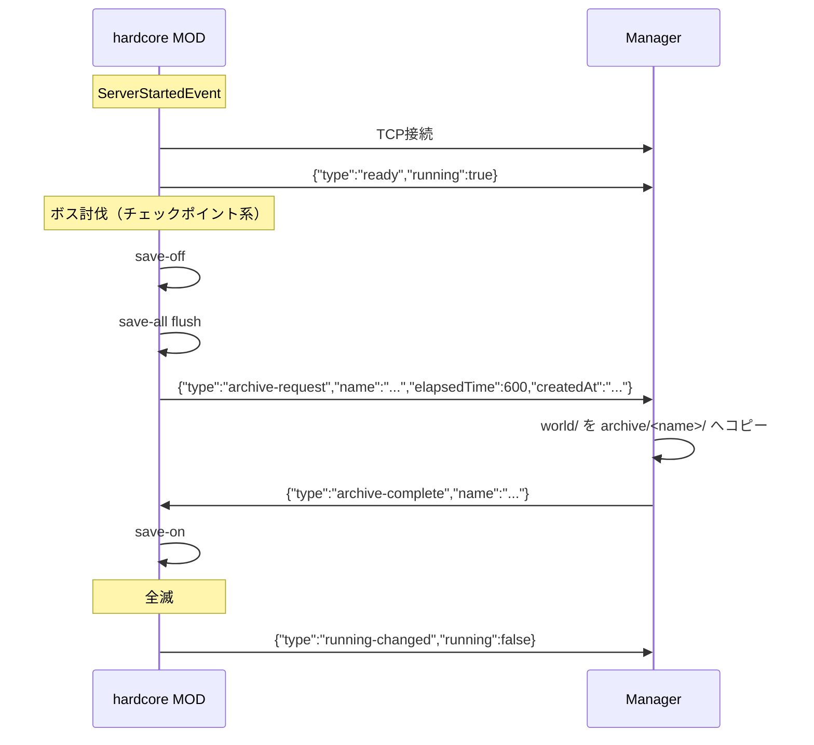

# MOD ⇔ Manager シグナルプロトコル

`specification.md` 6節の詳細版。hardcore MOD（NeoForge、Kotlin/Java）とManager（Go）の間で、hardcoreサーバーの起動完了・状態変化・アーカイブ要求をやり取りするためのプロトコル。

## 1. 前提・トランスポート

| 項目 | 内容 |
|---|---|
| トランスポート | TCPソケット |
| 待受アドレス | `127.0.0.1:<signalPort>`（Manager側、Managerの設定ファイルで`signalPort`を指定） |
| 接続方向 | hardcore MOD → Manager（MODがクライアント） |
| 接続タイミング | MODは`ServerStartedEvent`発火時に接続を開始し、成立後直ちに`ready`を送信する |
| 再接続 | 接続失敗時は数回リトライ＋バックオフして諦める（ログ出力のみ、致命的エラーにはしない） |
| メッセージ形式 | NDJSON（Newline-Delimited JSON）。1メッセージ＝1行のUTF-8 JSONオブジェクト＋`\n` |
| 判別方法 | 各メッセージの`type`フィールドで種別を判別する |
| セキュリティ | `127.0.0.1`限定リッスンにより、同一コンテナ内通信であることを前提にTLS/認証は行わない |

Managerとhardcoreサーバーは`os/exec`の親子プロセスとして**同一コンテナ内**で動作するため、`127.0.0.1`はコンテナ内ループバックとして解決される。MOD側はこの接続先アドレスを設定ファイルで持つ（Manager側の`signalPort`と値を一致させる必要がある）。

## 2. メッセージ一覧

| `type` | 方向 | 発生タイミング |
|---|---|---|
| `ready` | MOD → Manager | `ServerStartedEvent`発火時（起動完了直後、1回のみ） |
| `running-changed` | MOD → Manager | `running`の値が変化するたび（`/start`によるフレッシュ生成時の`true`初期化、全滅/挑戦終了系ボス討伐による`false`化） |
| `archive-request` | MOD → Manager | `/archive <name>`実行時、または指定ボス討伐時（`save-off`→`save-all flush`実行済みの状態で送信） |
| `archive-complete` | Manager → MOD | Managerがワールドフォルダのコピーを完了した時 |

## 3. メッセージ詳細

### 3.1 `ready`

MOD → Manager。起動完了を通知し、Managerが保持する`running`キャッシュの初期値を渡す。

| フィールド | 型 | 必須 | 説明 |
|---|---|---|---|
| `type` | string | ✓ | 固定値 `"ready"` |
| `running` | bool | ✓ | 起動直後の`running`値（`SavedData`から読み込んだ値、またはフレッシュ生成時は`true`） |

```json
{"type":"ready","running":true}
```

### 3.2 `running-changed`

MOD → Manager。`running`フラグが変化するたびに送信する。

| フィールド | 型 | 必須 | 説明 |
|---|---|---|---|
| `type` | string | ✓ | 固定値 `"running-changed"` |
| `running` | bool | ✓ | 変化後の`running`値 |

```json
{"type":"running-changed","running":false}
```

### 3.3 `archive-request`

MOD → Manager。`save-off`→`save-all flush`実行後に送信し、Managerによるワールドコピーを要求する。

| フィールド | 型 | 必須 | 説明 |
|---|---|---|---|
| `type` | string | ✓ | 固定値 `"archive-request"` |
| `name` | string | ✓ | アーカイブ名。手動実行時はOP指定、ボス討伐時は討伐日時から自動生成（`2026-07-18T12-34-56`形式） |
| `elapsedTime` | int64 | ✓ | 経過時間（秒数、long） |
| `createdAt` | string | ✓ | 作成日時（ISO 8601、`/load latest`の比較キー） |

```json
{"type":"archive-request","name":"2026-07-18T12-00-00","elapsedTime":600,"createdAt":"2026-07-18T12:00:00Z"}
```

`deadPlayerUUID`は含めない（死亡記録は挑戦記録データ側〔`specification.md` 5.5節〕へ完全移行済みのため不要）。

### 3.4 `archive-complete`

Manager → MOD。ファイルコピー完了を通知する。MODはこれを受けて`save-on`を実行する。

| フィールド | 型 | 必須 | 説明 |
|---|---|---|---|
| `type` | string | ✓ | 固定値 `"archive-complete"` |
| `name` | string | ✓ | 対応する`archive-request`の`name`と同じ値 |

```json
{"type":"archive-complete","name":"2026-07-18T12-00-00"}
```

## 4. 同期待ちの規約

MODは`archive-request`送信後、**同じ`name`を持つ`archive-complete`**を受信するまで`save-on`を実行せずに待つ。これにより、コピー中にオートセーブが再開してしまう事態を防ぐ。

名前重複によりManagerが`archive-request`を拒否した場合、現状**明示的な拒否シグナルは存在しない**（`specification.md` 10節の未決事項）。MODは`archive-complete`が一定時間（目安60秒、要確定）来ないことをもって失敗と判断し、OPへエラー表示する。

## 5. 接続断の扱い

TCP接続が切れた場合、Managerはhardcoreの状態を「不明」とみなし、`running`キャッシュを安全側（`true`扱い）に倒す。これにより`/start`・`/load`が誤って進行中の挑戦を破棄することを防ぐ（`specification.md` 3.1節）。

## 6. シーケンス例



## 7. 未決事項

- 接続リトライ回数・バックオフ設定値（`specification.md` 10節）
- `archive-request`拒否時の即時通知シグナル（`archive-rejected`案、未実装。`specification.md` 10節）
