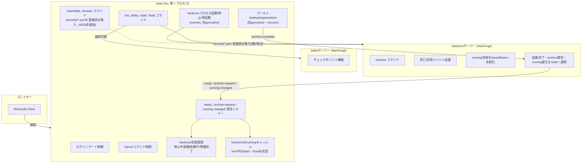

# Hardcore Together 仕様書

Paper+Velocity製の既存実装（`hardcore/`配下）をNeoForge+Gateへ移行するにあたっての設計仕様。

## 0. プロジェクト名

| コンポーネント | 名称 | mod id |
|---|---|---|
| hardcoreサーバーのMOD | **Hardcore Together** | `hardcoretogether` |
| lobbyサーバーのMOD | **Parkour Lobby** | `parkourlobby` |
| プロキシ（Gate拡張） | **Hardcore Together Gate** | — |

「Hardcore Together」は連帯責任（1人でも死ねば全員の挑戦終了）を表す名称。特定MODへの依存が無い汎用フレームワークであることも踏まえ、Twilight Forest等の固有名詞は含めていない（ボスは4.4節の設定ファイルで任意に指定可能）。「Parkour Lobby」は、チェックポイント機能がパルクールコースの中間セーブという位置づけであることを表す。以降、本文では簡潔さのため「hardcore MOD」「lobby MOD」と呼ぶ箇所があるが、いずれも上記の正式名称を指す。

**両MODとも、サーバーサイドのみで完結する。クライアント側へのMOD導入は不要**で、バニラクライアントのまま接続できる。カスタムの`Item`/`Block`登録（クライアントにも同期されるレジストリコンテンツ）は行わない。Parkour Lobbyのチェックポイント用アイテム・看板も、バニラのアイテム/看板ブロックへ`minecraft:custom_data`（サーバー側のみが解釈する任意NBT）でフラグを付与する方式にする（3.2節）。これにより、hardcoreサーバー・lobbyサーバーとも、Gate側のPCF（Proxy-Compatible-Forge、1節）さえ導入すればプレイヤーはMOD無しで参加できる。

## 1. 全体アーキテクチャ

サーバーは2種類、どちらもNeoForge製。プロキシはGate（minekube/gate、Go製）に、Hardcore Together Gate拡張を組み込んで使う。

| コンポーネント | 役割 |
|---|---|
| Hardcore Together Gate | 接続ルーティング、コマンドによるサーバー切替、hardcoreサーバーのプロセスライフサイクル管理（起動/停止/再起動）、ワールドのバックアップ/アーカイブ実行 |
| Parkour Lobby（lobbyサーバー、NeoForge） | チェックポイント機能を持つ、パルクールコース中心の待機所 |
| Hardcore Together（hardcoreサーバー、NeoForge） | RTA本体。死亡/討伐判定、タイマー、記録管理 |

旧Paper版の`ServerBooster`（プロキシ側でのプロセス管理・バックアップ）と`WorldArchiver`（ゲームサーバー側でのワールドコピー）の役割は、**すべてGateに統合**する。理由：
- NeoForgeには稼働中サーバーの中で任意名のワールドを動的生成・削除するBukkit相当のAPIが無いため、「新しい挑戦を始める」はサーバープロセスごとの再起動でしか実現できない
- プロセス管理とファイル操作を1箇所（Gate）に集約した方が、競合状態（同時に`/start`と`/archive`が走る等）を避けやすい

**前提：Gate・lobbyサーバー・hardcoreサーバーは同一ホスト上で動作する。** GateはGoの`os/exec`でhardcoreサーバープロセスを直接起動/停止する設計のため、リモートホストでの実行（別マシンでhardcoreサーバーを動かす構成）は想定していない。アーカイブ保存先（2.5節）もこの前提のもと、Gateから直接ファイル操作可能なローカルディスク上に置く。

lobby/hardcore両方がmoddedになったため、Vanilla/Paperとの混在互換性の懸念は無くなった。両サーバーにProxy-Compatible-Forge（PCF）を導入し、Velocity方式のforwardingで統一する。



## 2. Gate仕様

### 2.1 コマンド（Gateレベル、どのバックエンドに接続中でも使用可能）

| コマンド | 権限 | 動作 |
|---|---|---|
| `/rta` | 誰でも | hardcoreサーバーが「準備完了」状態なら接続を切り替える。「停止中」「起動処理中」ならその旨を表示するのみ |
| `/start` | OP | **hardcoreの`running`キャッシュが`true`の場合は実行を拒否**し「挑戦が進行中です」と表示する。`false`の場合のみ、①接続中の全プレイヤーをlobbyへ強制退避 ②プロセス停止 ③セーブフォルダ削除 ④プロセス再起動 ⑤`ready`受信で「準備完了」に遷移。**`ready`受信時点でlobbyに接続している全プレイヤーが自動でhardcoreへ接続切替される**（各自`/rta`を打つ必要はない） |
| `/start force` | OP | `running`キャッシュのチェックを**スキップ**し、進行中かどうかに関わらず強制的に①〜⑤を実行する。それ以外の手順（プレイヤー退避・`ready`待ち・自動転送）は通常の`/start`と同じ |
| `/load <name>` | OP | **hardcoreの`running`キャッシュが`true`の場合は実行を拒否**し「挑戦が進行中です」と表示する。`false`かつ`archive/<name>`が存在する場合のみ、`/start`と同様の手順（②③の間に「アーカイブ内容をセーブフォルダへ復元」を追加）を実行。**該当する名前のアーカイブが存在しない場合は「アーカイブ`<name>`は存在しません」と表示して何もしない**。`ready`受信時点でlobbyに接続している全プレイヤーが自動でhardcoreへ接続切替される |
| `/load <name> force` | OP | `running`キャッシュのチェックを**スキップ**し、進行中かどうかに関わらず強制的に復元・再起動を実行する。アーカイブが存在しない場合のエラー表示は通常の`/load <name>`と同じ（`force`はrunningチェックのみを免除するもので、存在チェックまでは免除しない） |
| `/load latest` | OP | `running`チェックは`/load <name>`と同様。`name`に`latest`を指定した場合、Gateが全アーカイブのメタデータ`createdAt`を比較し、最も新しいものを自動選択して`/load <name>`と同じ処理を行う。アーカイブが1件も無い場合はエラーメッセージを表示して何もしない |
| `/load latest force` | OP | `/load latest`と`/load <name> force`を組み合わせた動作（最新アーカイブを自動選択しつつ、runningチェックはスキップ） |
| `/lobby` | 誰でも | lobbyサーバーへ接続を切り替える |
| `/server` | 権限保有者のみ表示 | 旧`ServerCommandRestrictor`相当。無権限者には登録しない |

`/start`・`/load`の「自動転送」は、保留リストやスナップショットを持たない。`ready`信号を受信した時点で、そのときlobbyサーバーに接続している全プレイヤーに対して自動接続を行うだけでよい。

**`force`の適用範囲**：`force`は「hardcoreの`running`が`true`の場合に拒否する」チェックのみを免除する。2.5節の「アーカイブ実行中は`/start`・`/load`をブロックする」排他制御は`force`でも免除しない（ファイルコピーの最中にセーブフォルダを消すのは`running`とは別種の危険なので、これは常に守る）。`force`実行時は、進行中だった挑戦を強制的に中断・破棄することになるため、退避されるプレイヤーへの通知メッセージを通常の「ワールドリセットのためロビーに戻りました」から「管理者により強制リセットされました」に変える。

**`running`キャッシュ**：Gateは5節の`running-changed`シグナル（およびinitial値を含む`ready`シグナル）を受信するたびに、hardcoreの現在の`running`値をメモリ上にキャッシュする。`/start`・`/load`はこのキャッシュを見て、進行中の挑戦を誤って破棄しないようガードする。Gate起動直後などまだ一度も値を受け取っていない場合は、安全側に倒して`true`（進行中）扱いとし、`/start`・`/load`を拒否する。

### 2.2 hardcore状態管理

Gateはhardcoreサーバーの状態を内部で3値管理する。

```
停止中 → (/start or /load 受理) → 起動処理中 → (ready受信) → 準備完了
準備完了 → (/start or /load 受理) → 起動処理中 → ...
```

`/rta`は「準備完了」以外では接続を試みない（旧LoginControlが生死確認をしていなかったバグの修正）。

### 2.3 プロセス再起動時の退避

`/start`・`/load`受理時、Gateはプロセスを止める前に必ず、hardcoreに接続中の全プレイヤーをlobbyへ強制転送する。理由：退避なしにプロセスをkillすると、該当プレイヤーはネットワークごと切断されてしまうため。

### 2.4 異常切断時のフォールバック

`KickedFromServerEvent`をフックし、hardcoreから予期せず切断された場合は自動でlobbyへの再接続を試みる。上記2.3の退避処理が漏れた場合やクラッシュ時のセーフティネット。

### 2.5 アーカイブ実行

`archive-request`受信時、Gateはhardcoreサーバーのプロセスを止めずに、現在のセーブフォルダを`archive/<name>/`へコピーし、付随するメタデータ（経過タイム`elapsedTime`・作成日時`createdAt`）をJSONとして保存する。`createdAt`は`/load latest`で最新アーカイブを判定する際の比較キーとして使う。`/start`・`/load`によるプロセス再起動と同時に走らないよう、進行中はどちらか一方をブロックする。

**`archive/<name>/`の実体**：これは**Gate自身が管理する保存先ディレクトリ**であり、パスはGateの設定ファイル（例：`config.yml`の`archiveDir`）で指定する。hardcoreサーバーの作業ディレクトリ（`world/`などセーブフォルダを含む場所）とは別の場所に置く——`/start`で削除されるのは`world/`（セーブフォルダ）のみで、`archive/`はGateが管理する別ディレクトリなので影響を受けない。前提として、**Gateとhardcoreサーバープロセスは同一ホスト上で動作する**（Gateが`os/exec`で直接プロセスを起動/停止する設計のため、リモートホストでの実行は想定していない。1節参照）。

4.5節の`records/<challengeId>.json`（MOD管理、hardcoreサーバーのセーブフォルダの外）とは別物である点に注意：`archive/`はワールドの実体（セーブデータそのもの、Gate管理）、`records/`はイベントの記録（メタデータのみ、MOD管理）という役割分担になっている。

**名前の重複**：`archive/<name>/`が既に存在する場合、Gateは`archive-request`を拒否する（上書きしない）。
- 手動`/archive <name>`の場合：MODへ拒否を返し、MODはOPへ「その名前は既に使われています」と表示する
- ボス討伐による自動アーカイブの場合：名前は`<討伐時点の日時>`（例：`2026-07-18T12-34-56`、秒単位以上の精度を持つタイムスタンプ）とする。同一秒内に複数のボスが討伐される稀なケースに備え、衝突時はGate側で末尾に連番を付与して回避する（`2026-07-18T12-34-56-2`等）

サーバーを動かしたままの安全なコピーには`save-all flush`だけでは不十分（コピー中に次のオートセーブが走ると、一部ファイルだけ新しい状態になった「歪んだ」アーカイブができるリスクがある）。バニラ標準の`save-off`/`save-on`で書き込みを一時停止する手順を踏む：

1. MOD側で`save-off`（以降のオートセーブを一時停止。サーバー自体は動き続ける）
2. MOD側で`save-all flush`（この時点までの状態を即時・強制的に書き込む。`save-off`後でも`/save-all`は`noSave`フラグを無視して実行される）
3. MODがGateへ`archive-request`を送信
4. Gateがファイルコピーを実行し、完了したら`archive-complete`をMODへ返す
5. MODが`archive-complete`受信で`save-on`（オートセーブ再開）

`/archive`コマンド自体は4.2節の通りhardcore MODが直接持つ（Gateを経由しない）。理由は次節参照。

### 2.6 挑戦記録の参照コマンド（Gateレベル、どこからでも使用可能）

| コマンド | 権限 | 動作 |
|---|---|---|
| `/savedata` | 誰でも | hardcoreサーバーの起動有無に関わらず、Gateが4.5節の`records/<challengeId>.json`を（Gate・hardcoreが同一ホスト上にあるという1節の前提のもと）直接読み取り、全`challengeId`分横断して一覧表示する。MODへの問い合わせは行わない |
| `/senpan list\|count` | 誰でも | 同上の直接読み取りにより、全`challengeId`のイベントログから`type: death`のイベントを集計し、戦犯（死亡したプレイヤー）の一覧・回数を表示する |

`/savedata`・`/senpan`をMODへ問い合わせず、Gateが`records/`を直接読む設計にした理由は2つ：①Gateとhardcoreは同一ホスト上にある前提（1節・2.5節）なので、ファイルI/Oだけで完結できプロトコルを増やす必要がない、②hardcoreサーバーが停止中でも過去の挑戦記録を閲覧できる方が実用上望ましいため。

**`/archive`はこの方式にしない**：`/archive`は「オートセーブを一時停止する」という**稼働中のMinecraftサーバープロセスでしか実行できない操作**を必ず伴うため、実行者がhardcoreに接続している必要が実質的にある（hardcoreが起動していなければ何もできない）。これをGate経由の中継にすると、①新規シグナルの追加、②Gate中継メッセージをMOD側で受けた際に生じるスレッド設計上の注意点（受信スレッドで直接ブロッキング処理を行うとデッドロックしうる）、③hardcoreに繋いでいないかもしれない実行者へGateがメッセージを送る仕組み、が必要になり、得られる利便性（hardcoreに繋がずに手動アーカイブできる）に見合わない複雑さになると判断した。そのため`/archive`は4.2節の通りhardcore MODが直接登録する、従来通りの設計に留める。

## 3. Lobbyサーバー仕様（Parkour Lobby、NeoForge）

チェックポイント機能のみ。

### 3.1 データ永続化

プレイヤーごとのチェックポイント座標は`AttachmentType`でプレイヤーに紐づけて保存する（旧Paper版の`PersistentDataContainer`を直接プレイヤーに付与していたのと同等）。

### 3.2 コマンド

| コマンド | 権限 | 動作 |
|---|---|---|
| `/checkpoint` | 誰でも | 保存済みチェックポイントへテレポート。未保存ならロビースポーンへ |
| `/checkpoint reset` | 誰でも | 自分のチェックポイントを削除 |
| `/checkpoint reset <target>` | `checkpoint.reset` | 対象プレイヤーのチェックポイントを削除 |
| `/checkpoint give checkpoint_item\|reset_item\|checkpoint_sign\|reset_sign` | 誰でも | 該当アイテムを自分に付与 |
| `/checkpoint give ... <target>` | `checkpoint.give` | 対象プレイヤーに付与 |
| `/checkpoint help` | 誰でも | ヘルプ表示（OPには管理者コマンドも追加表示） |

チェックポイント用の看板・アイテムは**バニラのアイテム/看板ブロックをそのまま使う**（例：`minecraft:oak_sign`、任意のバニラアイテム）。新規`Item`/`Block`は登録しない（0節の「サーバーサイドのみで完結する」制約のため。カスタムレジストリコンテンツはクライアントにも同期が必要になり、MOD無しの接続ができなくなる）。フラグの持たせ方：
- アイテムは`minecraft:custom_data`（バニラのData Component、任意のNBTを保持できる。クライアントは中身を解釈しないが保持はする）へ、例えば`{"parkourlobby": {"kind": "checkpoint_sign"}}`のようなタグを埋め込む
- 表示名・Loreはバニラの`minecraft:custom_name`/`minecraft:lore`コンポーネントで独自に付与する（バニラクライアントでも通常のアイテム名/説明文として表示される）
- 看板は設置後、対応する`BlockEntity`側にも同様のカスタムNBTを保持させ、`PlayerInteractEvent`/設置イベントでこのNBTの有無を見て判定する

サーバー切替系のコマンド（旧`/rta`テレポート相当）はlobby MODには持たせない。すべてGate側の`/rta`・`/lobby`に統一する。

## 4. Hardcoreサーバー仕様（Hardcore Together、NeoForge）

### 4.1 状態永続化

`running`（進行中フラグ）・`challengeId`（挑戦ID、4.5節）を`SavedData`に保存する。クラッシュ後の再起動でも状態が失われないようにする（旧Paper版はメモリ上の変数のみで、再起動すると状態が消失するバグがあった）。

- `running`は`SavedData`の**新規作成時**（＝`/start`によるフレッシュなセーブフォルダ生成時、既存データが無い場合の初期値供給）に`true`として初期化する。以降は4.3節の死亡カウントダウン終了時・挑戦終了系ボス討伐時に`false`へ更新される
- **戦犯UUID（`dead`）は`SavedData`に置かない。** 旧Paper版では死亡発生時から後続の記録処理（`deleteRtaWorlds()`/`archive()`）まで値を一時保持する必要があったため`dead`フィールドが存在したが、NeoForge版では死亡イベント発生と同時に4.5節のイベントログへ直接書き込む設計に変更したため、値を跨tick・跨リスタートで保持する必要が無くなった。死亡ハンドラ内のローカル変数で完結する

`SavedData`はワールドのセーブフォルダ内に保存されるファイルであるため、Gateがフォルダごとバックアップ/復元する`/archive`・`/load`の対象に自然に含まれる。`/load`時に`running`・`challengeId`がその時点の状態へ巻き戻るのは意図通り（チェックポイントへ戻るとはそういうことなので）。

**経過時間だけは`SavedData`に置かない。** `SavedData`はチェックポイント復元で過去の値に巻き戻る仕組みであり、そこに経過時間を置くと「チェックポイントから全滅までの間に経過した時間」が`/load`のたびに失われてしまう。経過時間は4.5節の通り、セーブフォルダの外にある挑戦記録ファイル（イベントログ）の最新イベントを基準に管理し、`/load`で巻き戻らないようにする。

#### 経過時間の計測方式（tickではなく実時間）

旧Paper版の`RTATimer`は`runTaskTimer(plugin, 0, 20L)`で「20tickごとに+1」する方式で、サーバーのTPSが低下すると実時間からズレる欠点があった。NeoForge版では実時間ベースに変更する：

- サーバーtickごとに、前回tickからの実経過時間（`System.nanoTime()`による差分。壁時計調整の影響を受けないモノトニッククロックを使う）をメモリ上のカウンタへ加算する。起点は4.5節の挑戦記録ファイルの`lastKnownElapsedTime`
- `running=false`の間は加算しない（サーバーが止まっている間、あるいは挑戦終了後は経過時間が進まない）
- **数秒間隔（例：10秒ごと）で、その時点のカウンタ値を4.5節の挑戦記録ファイルの`lastKnownElapsedTime`へ都度書き込む。** イベント（セーブ/死亡/クリア）発生時にも同じフィールドを更新する。これにより、イベントの間隔がどれだけ空いても、クラッシュ時のロスは書き込み間隔（数秒〜数十秒）程度に収まる

### 4.2 コマンド（hardcore MODレベル、hardcore接続中のみ使用可能）

| コマンド | 権限 | 動作 |
|---|---|---|
| `/archive <name>` | OP | `save-off`→`save-all flush`を実行後、Gateへ`archive-request(name, elapsedTime, createdAt)`を送信。**`name`が既存アーカイブと重複する場合はGateに拒否され、OPへエラー表示して終了**（`save-on`のみ実行して中断）。成功時は`archive-complete`受信後に`save-on`で再開。サーバープロセスは止めない。あわせて4.5節のイベントログへ`type: save`（トリガー：実行したOP）を追記する |

`/start`・`/load`はhardcore MODには持たせない（Gateレベルのコマンドとして2.1節に記載。理由：hardcoreサーバーが未起動の状態でも呼び出せる必要があるため）。`/savedata`・`/senpan`も同様にhardcore MODには持たせず、Gateが直接読み取る（2.6節。理由：hardcore停止中・他バックエンド接続中でも使えるようにするため）。

一方`/archive`はhardcore MODが直接持つ（Gateへ中継しない）。`/archive`は稼働中のMinecraftサーバープロセスでしか実行できない操作（オートセーブの一時停止）を必ず伴うため、「hardcoreに接続していなくても実行できる」という利点が実質的に無く、Gate中継に伴う複雑さ（新規シグナル、受信スレッドでのデッドロック回避、hardcoreに繋いでいない実行者へのメッセージ配送）に見合わないと判断した（2.5節参照）。旧`/rta`（同一プロセス内での複数ワールド間テレポート）は廃止（lobby/hardcoreが別プロセスになったため不要）。

### 4.3 ゲームプレイ仕様

- サーバー起動時のhardcoreモード・難易度HARDは、Gateがコピーするセーブテンプレート自体に焼き込む（NeoForgeにランタイムでの`setHardcore`相当APIが無いため）
- プレイヤー参加時：参加メッセージは非表示
- **プレイヤー死亡時**（`LivingDeathEvent`、対象がPlayerかつ`running=true`の場合のみ）：
  1. 次tickでスペクテイターへ強制リスポーン（体力/満腹度リセット）
  2. 既にカウントダウン中でなければ、4.5節のイベントログへ`type: death`のイベントを追記する。死亡したプレイヤー（UUID・名前）と、そのときのキルログ（`LivingDeathEvent`の`DamageSource`から得られる死亡メッセージ相当の情報）を含める。`/archive`の実行有無に関係なく必ず行う
  3. 全員に死亡演出（タイトル＋効果音）
  4. 10秒カウントダウン演出。終了時、まだSURVIVAL状態の全プレイヤーをSPECTATORへ強制送還し、`running=false`・理由「全滅」としてSavedDataに保存
  - 仕様：1人でも死亡すればパーティ全体の挑戦終了（個々のプレイヤーが生存していても終了する）
- **指定ボスMob討伐時**（`LivingDeathEvent`、対象が設定済みボスリストに含まれるMobかつ`running=true`の場合）：ボスごとに「チェックポイント系」「挑戦終了系」のどちらかを設定ファイルで指定する。共通処理は以下：
  1. `save-off`→`save-all flush`
  2. Gateへ`archive-request(name, elapsedTime, createdAt)`を送信。`name`はプレイヤー入力が無いため討伐時点の日時から自動生成する（2.5節参照。衝突時はGate側で連番を付与するため、ここでの失敗は基本的に発生しない）
  3. `archive-complete`受信で`save-on`
  4. 4.5節のイベントログへ、討伐したボスのMob IDをトリガーとして含むイベントを追記する

  この後の扱いがカテゴリごとに分岐する：
  - **チェックポイント系**：`running`はfalseにしない。タイマーも継続する（挑戦は続行）。追記するイベントは`type: save`
  - **挑戦終了系**：`running=false`・理由「討伐クリア:<ボス名>」としてSavedDataに保存。タイマーはリセットではなく停止として記録（旧Paper版のエンダードラゴン討伐時と同じ扱い）。追記するイベントは`type: clear`

  - 対象ボスの分類は4.4節の設定ファイルで管理する
  - 手動`/archive`コマンドの場合も同様に4.5節へ`type: save`のイベントを追記する。トリガーがMobではなく実行したOPになる点のみ異なる（内部のアーカイブ処理自体は共通）
- 挑戦終了後にlobbyへ戻るのは手動（`/lobby`を自分で打つ）。自動一括転送は行わない

### 4.4 ボス設定ファイル

チェックポイント系・挑戦終了系のどちらも、**複数指定を前提としたリスト**として設定ファイルで管理する（挑戦終了系も「念のため複数」を許容し、1体固定にはしない）。

```toml
[bosses]
# 討伐すると自動アーカイブするが、挑戦は継続するボス（複数可）
checkpoint = [
    "twilightforest:naga",
    "twilightforest:lich",
    "twilightforest:hydra",
    "twilightforest:knight_phantom"
]

# 討伐すると自動アーカイブし、running=falseにして挑戦終了とするボス（複数可）
clear = [
    "twilightforest:ur_ghast",
    "twilightforest:alpha_yeti"
]
```

- 値はMobのレジストリID（`modid:path`形式）の文字列配列
- `checkpoint`・`clear`いずれも0件〜複数件を許容する。同一IDを両方に重複登録した場合は`clear`側を優先する（挑戦終了を取りこぼさないため）
- サーバー起動時に読み込み、`LivingDeathEvent`ハンドラ内で対象EntityTypeのIDをこの2リストと照合して分岐する
- デフォルト値は黄昏の森（Twilight Forest）のボス群を想定した上記の例だが、具体的にどのボスをどちらに分類するかは8節の未決事項として最終確認が必要

### 4.5 挑戦記録データ（challengeIdごとのイベントログ）

`/savedata`・`/senpan`が参照する記録、および経過時間の継続計算は、すべてこの仕組みに一本化する。アーカイブ機構（Gateの`archive-request`）とは独立しており、`/archive`を一度も実行しない挑戦であっても、死亡・クリアの結果は必ず記録される。

**ファイル配置**

- **`challengeId`ごとに1ファイル**を作成する（単一ファイルへの集約はしない）。例：`records/<challengeId>.json`
- 配置場所はhardcore MODの設定ファイル（`storage.recordsDir`、デフォルト値`records`）で指定する。相対パスはhardcoreサーバーの作業ディレクトリ基準（デフォルトなら`<hardcoreサーバー作業ディレクトリ>/records/<challengeId>.json`、`world/`と同階層）、絶対パスはそのまま使う。Gateが`/start`時に削除するのは`world/`のみなので、この場所は影響を受けない。archive/（Gate管理、hardcoreサーバーの作業ディレクトリの外）とは別の場所である点に注意（9節参照）
- **書き込み**はhardcore MODがサーバープロセス内で直接行うローカルファイルI/Oで完結し、Gateを経由しない（5節の`archive-request`/`archive-complete`とは無関係）
- **読み取り**（`/savedata`・`/senpan`、2.6節）はhardcore MODを経由せず、Gateが同一ホスト前提でこのファイルを直接読み取る。書き込み側と読み取り側で経路が異なる点に注意
- **設定を分ける2つのプロセスが同じ場所を見る必要がある**：`storage.recordsDir`はhardcore MOD自身の設定ファイルの値だが、Gateも同じ場所を読みに行く（2.6節）ため、Gate側の設定（例：`config.yml`の対応する値）と必ず一致させる必要がある。値を変更する場合は両方を同時に更新すること

**ファイル構造**

```json
{
  "challengeId": "a1b2c3d4-...",
  "lastKnownElapsedTime": 1500,
  "events": [
    { "...": "イベントは種別ごとに以下のいずれかの形" }
  ]
}
```

`elapsedTime`はすべて**long型（秒数）**で保持する（`"01:23:45"`のような整形済み文字列では保存しない。表示が必要な箇所でのみ都度フォーマットする）。`lastKnownElapsedTime`はルート直下のフィールドで、4.1節の定期永続化（数秒間隔）とイベント発生時の両方で更新される、経過時間の最新値。

**命名について**：ルート直下の値を`events[i].elapsedTime`と同じ`elapsedTime`にしなかったのは、両者が別の意味を持つため。`events[i].elapsedTime`は各イベント発生時点の確定した歴史的記録（書いたら変わらない）で、`lastKnownElapsedTime`は定期書き込みとイベント発生の両方で更新され続ける値であり、通常は直近のイベントより進んだ値になる（イベント間もサーバーは動き続け、10秒ごとにこの値だけ更新されるため）。`lastKnown`（最後に確認できた）という接頭辞で、「最大で心拍間隔（10秒）分古い可能性はあるが、クラッシュ復旧時に使える最良の値」という位置づけを明示している。

全イベント共通のフィールド：`type`（`save` | `death` | `clear`）、`elapsedTime`（そのイベント時点の経過時間、秒数）、`timestamp`（発生した壁時計日時、表示・ソート用でelapsedTime計算には使わない）。

- **`save`**（`/archive`実行時、またはチェックポイント系ボス討伐時）：
  ```json
  { "type": "save", "elapsedTime": 600, "timestamp": "2026-07-18T12:00:00Z",
    "archiveName": "2026-07-18T12-00-00",
    "trigger": { "kind": "boss", "mobId": "twilightforest:naga" } }
  ```
  手動`/archive`の場合は`trigger`が`{ "kind": "manual", "player": "<実行したOPのUUID>" }`になる
- **`death`**（プレイヤー死亡時）：
  ```json
  { "type": "death", "elapsedTime": 900, "timestamp": "2026-07-18T12:05:00Z",
    "deadPlayer": { "uuid": "...", "name": "Steve" },
    "killLog": "Steve was slain by Zombie" }
  ```
  `killLog`は`LivingDeathEvent`の`DamageSource`から得られるバニラの死亡メッセージ相当の文字列（将来的に攻撃者エンティティ種別等を構造化して追加してもよい）
- **`clear`**（挑戦終了系ボス討伐時）：
  ```json
  { "type": "clear", "elapsedTime": 1500, "timestamp": "2026-07-18T12:45:00Z",
    "trigger": { "kind": "boss", "mobId": "twilightforest:ur_ghast" } }
  ```

**経過時間の継続（`/load`時の巻き戻り対策）**

- サーバー起動時、現在の`challengeId`（`SavedData`から取得）に対応する`records/<challengeId>.json`が存在すれば、ルート直下の`lastKnownElapsedTime`を読み取り、そこから実時間加算を再開する
- ファイルが存在しない（`/start`直後で初めての場合）場合は`lastKnownElapsedTime=0`から開始する
- これにより、`/load`でセーブフォルダ（＝ワールド状態）が古いチェックポイントに巻き戻っても、経過時間は巻き戻らず、直前まで進んでいた時点から継続する。イベントの間隔が空いていても、定期永続化のおかげで巻き戻り基準点は最新に近い値を保つ

**コマンドからの参照**

- `/savedata`：全`challengeId`のファイルを横断して、`save`/`death`/`clear`イベントの一覧を表示
- `/senpan list|count`：全`challengeId`のファイルから`type: death`のイベントを集計し、`deadPlayer`ごとの一覧・回数を表示

（いずれも2.6節の通りGateが直接ファイルを読み取って実現する。hardcoreサーバーの起動有無に関わらず参照可能）

**例（ご指摘の例に対応）**

```
/start                          → challengeId=A発行。records/A.json新規作成、lastKnownElapsedTime=0、events=[]
チェックポイント系ボス討伐        → events: [ save(elapsedTime=T1, trigger=boss:naga) ]、lastKnownElapsedTime=T1
全滅                            → events: [ save(T1), death(elapsedTime=T2, deadPlayer=Steve, killLog=...) ]、lastKnownElapsedTime=T2
/load save1                      → ワールドはT1時点に巻き戻るが、経過時間はrecords/A.jsonのlastKnownElapsedTime(T2)から再開
討伐クリア                       → events: [ save(T1), death(T2), clear(elapsedTime=T2+その後の経過, trigger=boss:ur_ghast) ]、lastKnownElapsedTimeも同値に更新
```

`records/A.json`には`save`・`death`・`clear`の3イベントがすべて時系列で残り、全滅の事実・時刻・キルログを含めて挑戦Aの経緯を後から完全に追跡できる。

## 5. MOD⇔Gate間シグナル

| シグナル | 方向 | 発生タイミング | ペイロード |
|---|---|---|---|
| `ready` | hardcore MOD → Gate | `ServerStartedEvent`発火時 | `running`（起動直後の`running`値。Gateの2.1節キャッシュの初期値として使う） |
| `running-changed` | hardcore MOD → Gate | `running`の値が変化するたび（新規作成時の`true`初期化、全滅/挑戦終了系ボス討伐による`false`化） | `running`（変化後の値） |
| `archive-request` | hardcore MOD → Gate | `/archive <name>`実行時（`save-off`済み） | `name`, `elapsedTime`（long、秒数）, `createdAt`（作成日時、`/load latest`の比較に使用） |
| `archive-complete` | Gate → hardcore MOD | ファイルコピー完了時 | `name`（MODはこれを受けて`save-on`を実行） |

`archive-request`から`deadPlayerUUID`は削除した。死亡記録は4.5節のイベントログに完全移行しており、セーブ（チェックポイント）イベントに死亡プレイヤー情報を含める理由が無いため。

### 5.1 通信方式：永続TCPソケット＋NDJSON

Gateには`GateService`という組み込みのgRPC/HTTP APIがあるが、これはGateプロキシ自体の管理（プレイヤー一覧・サーバー登録など）専用の固定APIであり、`archive-request`のようなHardcore Together独自のシグナルを流すための汎用の仕組みではない。そのため、MOD⇔Gate間には専用の軽量な通信路を別途用意する。

- **トランスポート**：TCPソケット。Gateが`127.0.0.1`限定でリッスンする（1節の「同一ホスト前提」に基づく。同一ホスト内通信のためTLS/認証は不要と判断）。ポート番号はGateの設定ファイルで指定（例：`signalPort`）
- **接続方向**：hardcore MOD側が接続しにいく。Gateは常駐プロセス、hardcore MODは`/start`・`/load`のたびにプロセスごと生成・破棄されるため、短命な側（MOD）が長命な側（Gate）へ接続する方が自然
- **接続タイミング**：MODは`ServerStartedEvent`発火時に接続し、直後に`ready`を送る。接続失敗時は数回リトライ＋バックオフして諦める（ログ出力）
- **メッセージ形式**：改行区切りJSON（NDJSON）。1メッセージ＝1行のJSONオブジェクト。`type`フィールドで5節の表のどのシグナルかを判別する

```json
{"type":"ready","running":true}
{"type":"running-changed","running":false}
{"type":"archive-request","name":"2026-07-18T12-00-00","elapsedTime":600,"createdAt":"2026-07-18T12:00:00Z"}
{"type":"archive-complete","name":"2026-07-18T12-00-00"}
```

- **`archive-request`の同期待ち**：MODは送信後、対応する`archive-complete`（同じ`name`）を受信するまで待ってから`save-on`を実行する（2.5節の手順）
- **接続断の扱い**：接続が切れたら、Gateはhardcoreの状態を「不明」とみなし、`running`キャッシュは安全側（`true`扱い、`/start`・`/load`拒否）にする（2.1節と整合）
- protobuf/ConnectRPCのような型付けIDLは採用しない。シグナル数が少なく（4種）、Gate本体と同じ技術スタックに揃える必要性より、依存を増やさないシンプルさを優先した

## 6. コマンド一覧（全体まとめ）

| コマンド | 実行元 | 権限 |
|---|---|---|
| `/rta` | Gate（どこからでも） | 誰でも |
| `/lobby` | Gate（どこからでも） | 誰でも |
| `/start` | Gate（どこからでも） | OP |
| `/start force` | Gate（どこからでも） | OP |
| `/load <name>` | Gate（どこからでも） | OP |
| `/load <name> force` | Gate（どこからでも） | OP |
| `/load latest` | Gate（どこからでも） | OP |
| `/load latest force` | Gate（どこからでも） | OP |
| `/server` | Gate | 権限保有者のみ表示 |
| `/checkpoint` 系 | lobby MOD | 誰でも／一部OP相当権限 |
| `/archive <name>` | hardcore MOD（hardcore接続中のみ） | OP |
| `/savedata` | Gate（どこからでも。hardcore停止中も可、`records/`を直接読み取り） | 誰でも |
| `/senpan list\|count` | Gate（どこからでも。hardcore停止中も可、`records/`を直接読み取り） | 誰でも |

## 7. 決定ログ

- ロビーもmoddedにする（Vanilla/Paperとの混在は不採用）
- `/archive`コマンド自体は自動化せず、手動のまま維持する。ただし指定ボスMob討伐時は別途イベント経由で自動アーカイブが走る
- ボスMobは設定ファイルで「チェックポイント系（討伐しても挑戦継続）」「挑戦終了系（討伐でrunning=falseにしてクリア扱い）」のどちらかに分類できるようにする。挑戦を明示的に終了させるトリガーは「プレイヤー死亡（全滅）」と「挑戦終了系ボスの討伐」の2種類になる
- チェックポイント系・挑戦終了系はどちらも複数指定可能なリストとしてconfigで管理する（挑戦終了系も1体固定にせず、念のため複数を許容する）
- サーバー起動・ワールドバックアップの責務はGateに統合する（別プロセスのSupervisorは作らない）
- 参加コマンドは`/join`ではなく`/rta`
- `/start`・`/load`実行後、`ready`受信時点でlobbyにいる全プレイヤーが自動でhardcoreへ接続される(スナップショットは取らない)
- 挑戦終了後のlobby帰還は手動（自動一括転送はしない）
- `/archive`はサーバーを止めずに実行可能。ただし`save-all flush`だけでは不十分で、`save-off`→コピー→`save-on`のブラケットが必須
- `/load latest`で、全アーカイブの中から`createdAt`が最も新しいものを自動選択して復元できるようにする
- 挑戦記録データ（`/savedata`・`/senpan`用）はアーカイブ機構から独立させ、セーブフォルダ外に**`challengeId`ごとの個別JSONファイル**としてMODが直接追記する。`/archive`の実行有無に関わらず、イベント発生のたびに必ず記録される
- 経過時間はtickカウントではなく実時間（tick間の実経過時間の積算）で計測する
- 挑戦ID（`challengeId`）を導入し、`/start`で新規発行・0秒から開始する。`challengeId`自体は`SavedData`経由で`/load`と一緒に巻き戻ってよいが、経過時間は`SavedData`に置かず、その`challengeId`のイベントログファイルにある**`lastKnownElapsedTime`**（数秒間隔で定期永続化される値）から継続計算する（`SavedData`内に置くと、チェックポイント復元のたびに全滅までの時間が失われるため）
- 記録イベントは`save`（`/archive`実行時・チェックポイント系ボス討伐時、トリガーmob/OPを含む）・`death`（プレイヤー死亡時、死亡者とキルログを含む）・`clear`（挑戦終了系ボス討伐時、トリガーmobを含む）の3種類。1つの`challengeId`のファイルに時系列で追記されていく
- `running`は`SavedData`の新規作成時（`/start`によるフレッシュなセーブフォルダ生成時）に`true`で初期化する
- 戦犯UUID（`dead`）は`SavedData`に保存しない。死亡イベント発生と同時に4.5節のイベントログへ直接書き込むため、値を跨tick・跨リスタートで保持する必要が無い
- 全体レビューで見つかった以下の抜け・矛盾を修正：
  - `/start`・`/load`はhardcoreの`running`が`true`（挑戦進行中）の場合は拒否する。Gateは`ready`/`running-changed`シグナルで`running`値をキャッシュして判定する
  - `archive-request`から`deadPlayerUUID`を削除（死亡記録は4.5節のイベントログに完全移行済みのため不要だった）
  - 経過時間の永続化は「イベント発生時のみ」ではなく、数秒間隔の定期書き込み（`lastKnownElapsedTime`）に戻す。イベント間隔が空いてもクラッシュ時のロスを書き込み間隔程度に抑える
  - `/archive <name>`は名前の重複を拒否する。ボス討伐による自動アーカイブの名前は`<討伐時点の日時>`とし、衝突時はGate側で連番を付与する
  - `/load <name>`で該当アーカイブが存在しない場合はエラーメッセージを返す
  - `elapsedTime`は整形済み文字列ではなくlong（秒数）で保持する。表示時にのみフォーマットする
  - 全滅カウントダウン中の2人目以降の死亡イベントはログに記録しない（最初の死亡のみを戦犯として扱う、現行仕様のまま）
  - 死亡時にGateへの`archive-request`は送らない（死亡直後のワールド状態そのものは自動バックアップしない、現行仕様のまま）
- Gate・lobby・hardcoreは同一ホスト上で動作する前提を明記。`archive/<name>/`はGate自身が管理するディレクトリ（設定ファイルでパス指定）で、hardcoreサーバーの作業ディレクトリとは別の場所に置く
- `records/<challengeId>.json`の配置場所を確定：hardcoreサーバーの作業ディレクトリ内、`world/`と同階層の`records/`フォルダ（Gate管理の`archive/`とは別の場所）
- 全パス情報を9節「ディレクトリ構成」に集約した
- `/start force`・`/load <name> force`・`/load latest force`を追加。`running=true`（挑戦進行中）による拒否チェックのみを免除し、進行中の挑戦を強制的に中断・破棄できるようにする。アーカイブ実行中の排他制御など他の安全機構は`force`でも免除しない
- プロジェクト名を確定：hardcoreサーバーのMODは**Hardcore Together**（連帯責任を表す。特定MODに依存しない汎用フレームワークのため固有名詞は含めない）、lobbyサーバーのMODは**Parkour Lobby**（チェックポイントはパルクールコースの中間セーブという位置づけ）、プロキシは**Hardcore Together Gate**
- 両MODとも**サーバーサイドのみで完結**させる。クライアント側へのMOD導入は不要とし、カスタム`Item`/`Block`登録は行わない。Parkour Lobbyのチェックポイント用アイテム・看板はバニラのアイテム/看板ブロックに`minecraft:custom_data`でフラグを付与する方式に変更した
- MOD⇔Gate間シグナルの通信方式を確定：永続TCPソケット＋NDJSON（改行区切りJSON）。Gateの組み込みAPI（`GateService`）はプロキシ管理専用の固定APIでHardcore Together独自シグナルには使えないため、専用の軽量ソケットを別途用意する。protobuf/ConnectRPCは今回の規模（シグナル4種）にはオーバースペックと判断し不採用
- 【修正】`/savedata`・`/senpan`を、hardcore MODレベル（hardcore接続中のみ実行可）からGateレベル（どこからでも実行可能、2.6節）へ変更した。Gateが`records/<challengeId>.json`を（Gate・hardcoreが同一ホスト上にあるという1節の前提のもと）直接読み取ることで実現し、hardcore停止中でも閲覧可能にした
- 【検討の上、不採用】`/archive`も同様にGateレベルへ移し、Gateがhardcore MODへ新設シグナルを中継する案を一時検討したが、不採用とした。`/archive`は稼働中のMinecraftサーバープロセスでしか実行できない操作（オートセーブの一時停止）を必ず伴うため「hardcoreに接続していなくても実行できる」利点が実質的に無く、中継のために必要になる複雑さ（新規シグナル2種、Gate接続の受信スレッドで直接処理するとブロッキングによりデッドロックしうる問題への対処、hardcoreに繋いでいない実行者へのメッセージ配送）に見合わなかった。`/archive`は引き続きhardcore MODレベルの直接コマンドのまま維持する（4.2節）
- `records/`の配置パスをhardcore MODの設定ファイル（`storage.recordsDir`、デフォルト`records`）から指定できるようにした。理由：このパスはhardcore MOD（書き込み）とGate（`/savedata`・`/senpan`用の読み取り、2.6節）という2つの別プロセスが同じ場所を見に行く必要がある、プロセスをまたいで読まれる唯一のデータであるため。値を変える場合はGate側の設定も同時に更新する必要がある（4.5節）

## 8. 未決事項

- Gate⇔バックエンド間のタイムアウト設定値
- PCF（Proxy-Compatible-Forge）の具体的なバージョン・設定詳細
- 権限ノード名の最終決定（`checkpoint.reset`等は旧Paper版からの仮称）
- lobby/hardcore間でのコード共有（commonモジュール化）の要否
- ボスMobの具体的なリストと、チェックポイント系/挑戦終了系それぞれへの分類（黄昏の森のどのボスをどちらにするか）
- `hardcoretogether`のテンプレート由来の`ModBlocks.kt`（`example_block`というカスタムBlockを登録）は「サーバーサイドのみで完結する」制約に反するため、実装時に削除する必要がある
- **既存の抜け**：`archive-request`が名前重複でGateに拒否された場合、それを明示的にMODへ伝えるシグナルが5節に存在しない（MODは`archive-complete`が来ないことによる60秒タイムアウトでしか失敗を検知できない）。OPへのエラー表示がこの60秒待ちに引きずられる形になる。将来的に`archive-rejected`のような即時拒否シグナルを追加して解消するのが望ましいが、今回は既存の挙動を変えない範囲に留めた

## 9. ディレクトリ構成

これまで各節に分散して書いていたパス情報をここに集約する。前提は1節の通り、Gate・lobbyサーバー・hardcoreサーバーは同一ホスト上で動作する。

```
<hardcoreサーバーの作業ディレクトリ>/        … Gateがos/execで起動するプロセスのルート
├── world/                                   … セーブフォルダ。/startで削除・再生成される対象
│   ├── data/                                … SavedData（running・challengeId。4.1節）
│   └── ...                                  … region, playerdata等、標準NeoForgeサーバー構成
├── records/                                 … MOD管理。/startでも削除されない（4.5節）。パスはMODの
│   │                                          storage.recordsDir設定で変更可（デフォルトがこの位置）
│   └── <challengeId>.json                   … 挑戦ごとのイベントログ
├── mods/, config/, server.properties 等     … 標準NeoForgeサーバー構成（本仕様の対象外）

<Gateの作業ディレクトリ>/
├── config.yml                               … Gate設定（archiveDir、lobby/hardcoreの接続情報等）
└── <archiveDir>/                            … 例: archive/（2.5節）
    └── <name>/
        ├── world/                           … アーカイブ時点のセーブフォルダの複製（SavedData含む）
        └── meta.json                        … elapsedTime・createdAt（2.5節）

<lobbyサーバーの作業ディレクトリ>/
└── world/playerdata/                        … チェックポイント座標はAttachmentType経由でプレイヤーデータに
                                                 埋め込まれる（3.1節）。専用ファイルは持たない
```

**役割の対比**

| パス | 管理主体 | 内容 | `/start`での扱い |
|---|---|---|---|
| `<hardcore>/world/` | hardcoreサーバー本体（バニラ/NeoForge） | ワールドの実データ＋`SavedData` | 削除・再生成される |
| `<hardcore>/records/`（`storage.recordsDir`で変更可） | hardcore MOD（書き込み）／Gate（`/savedata`・`/senpan`用の読み取りのみ、2.6節） | 挑戦ごとのイベントログ（JSON） | 削除されない |
| `<Gate>/<archiveDir>/<name>/` | Gate | アーカイブされたワールドの複製＋メタデータ | 対象外（Gate管理のため） |
| `<lobby>/world/playerdata/` | lobby MOD（バニラ機構経由） | チェックポイント座標 | 対象外（別サーバー） |

`archive/<name>/meta.json`というファイル名は本節で初めて具体化した（2.5節では「メタデータをJSONとして保存する」とだけ書いていた）。実装時に別名にする場合はこの節を更新すること。
